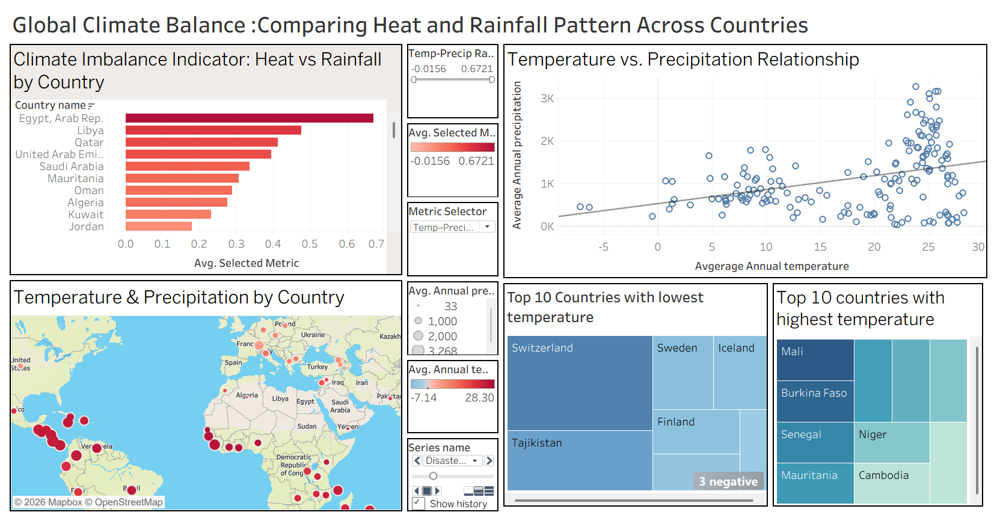
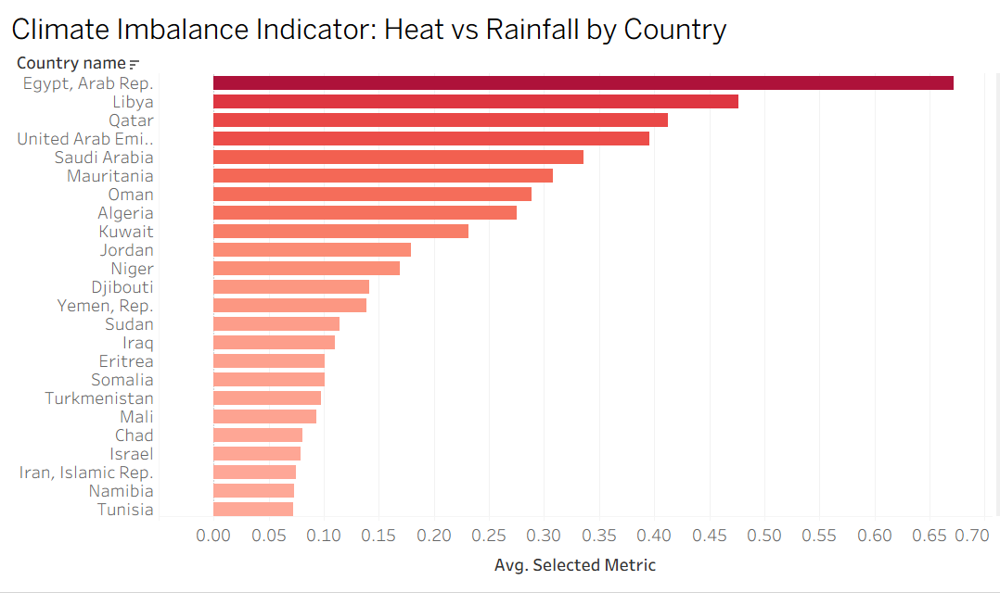
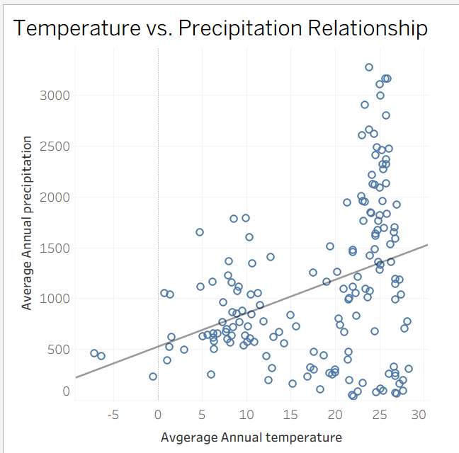
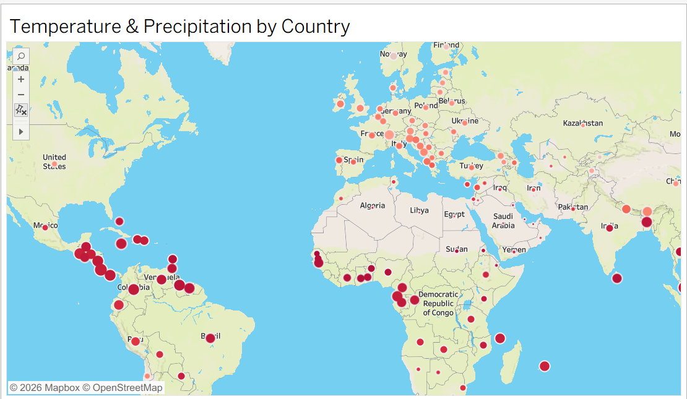
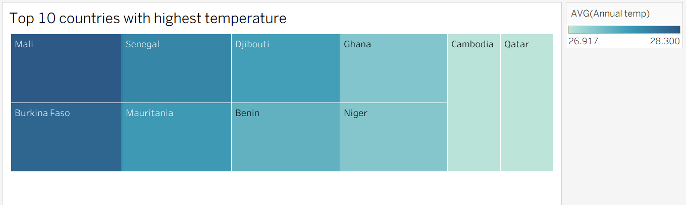
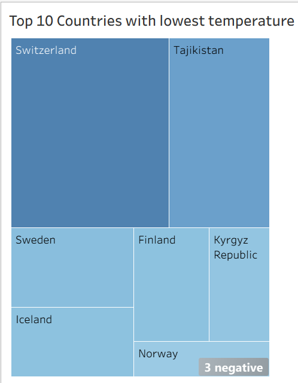

# Climate Balance & Agricultural Impact Dashboard using Tableau

## Project Summary

This project presents an interactive Tableau dashboard that analyses how climate conditions may affect agriculture across different countries and regions. The dashboard focuses on important climate and agricultural indicators such as temperature, precipitation, crop yield, irrigation access, soil health, extreme weather events, adaptation strategies, and economic impact.

The main objective of this project is to identify climate-risk patterns that may affect agricultural productivity and present the findings through clear, interactive visual storytelling.

This project demonstrates how Tableau can be used to transform climate and agriculture data into a decision-support dashboard for agricultural planning, water-resource management, and climate adaptation.

## Business Problem

Climate change can directly affect agriculture through rising temperatures, irregular rainfall, drought, extreme weather events, water stress, and reduced crop productivity. These challenges can create serious risks for farmers, policymakers, agricultural planners, and food-security organisations.

Decision-makers need simple and interactive tools to identify which countries or regions may be more exposed to agricultural climate risk.

This dashboard helps answer the following questions:

- Which countries or regions may be more exposed to climate-related agricultural risk?
- How do temperature and precipitation patterns relate to agricultural conditions?
- Which areas may require better irrigation planning or adaptation strategies?
- Where can policymakers focus climate adaptation and agricultural support?
- How can climate indicators be communicated clearly through dashboard storytelling?

## Tools Used

- Tableau
- Data visualisation
- Dashboard design
- Interactive filters and tooltips
- Climate and agriculture data analysis

## Dataset

The project uses the `climate_change_impact_on_agriculture_2024.csv` dataset, which contains 10,000 records and 15 columns related to climate, agriculture, crop production, irrigation, soil health, adaptation strategies, and economic impact.

Key fields include:

- Year
- Country
- Region
- Crop type
- Average temperature
- Total precipitation
- CO2 emissions
- Crop yield
- Extreme weather events
- Irrigation access
- Pesticide use
- Fertilizer use
- Soil health index
- Adaptation strategies
- Economic impact

Dataset file:

- `data/climate_change_impact_on_agriculture_2024.csv`

## Dashboard Preview



## Dashboard Visualisations and Analysis

### 1. Climate Imbalance Indicator - Heat vs Rainfall by Country



This horizontal bar chart ranks countries based on climate imbalance between temperature and rainfall. The purpose of this visual is to identify countries where heat levels are high compared with rainfall availability.

A higher imbalance may indicate stronger climate stress, especially for countries that depend heavily on rain-fed agriculture. These countries may face higher risk of drought, irrigation demand, soil moisture loss, and reduced crop productivity.

Why this visual was used:

- It provides a clear country-level ranking.
- It helps identify high-risk countries quickly.
- Horizontal bars make country names easier to read.
- Colour intensity supports quick interpretation of climate stress.

Analytical insight:

This chart converts climate variables into a practical risk-ranking view. Instead of only showing temperature and rainfall separately, it helps identify countries where the combination of heat and lower rainfall may create agricultural pressure.

### 2. Temperature vs Precipitation Scatter Plot



This scatter plot compares average temperature with total precipitation. It helps show whether hotter countries or regions also receive higher or lower rainfall.

This visual is important because agricultural risk cannot be understood from temperature alone. Some regions may be warm and dry, while others may be warm and wet. These two groups can face very different agricultural challenges.

For example:

- Warm and dry regions may face drought, irrigation demand, and crop yield pressure.
- Warm and wet regions may face flooding, pest growth, crop disease, or drainage-related challenges.

Why this visual was used:

- It shows the relationship between two important climate variables.
- It helps identify clusters and outliers.
- It separates warm-dry and warm-wet patterns.
- It supports deeper analysis beyond simple ranking.

Analytical insight:

The scatter plot shows that temperature alone is not enough to explain agricultural climate risk. Rainfall context is also necessary, making the analysis more useful for agriculture and water-resource planning.

### 3. Temperature and Precipitation Map



The map visualisation shows climate and agriculture patterns geographically. It helps identify regional clusters where high temperature, low rainfall, or other climate-related risks may overlap.

This view is useful because climate risk is strongly connected to location. A map allows users to quickly understand whether climate stress is concentrated in specific countries or regions.

Why this visual was used:

- It adds geographical context to the analysis.
- It helps identify regional climate-risk hotspots.
- It supports policy and agricultural planning decisions.
- It makes the dashboard easier for non-technical users to understand.

Analytical insight:

The map improves the storytelling value of the dashboard by showing where climate risks are located, not just which countries have high values. This makes the dashboard more useful for decision-makers who need to prioritise resources by region.

### 4. Top 10 Countries with Highest Temperature



This treemap highlights the countries with the highest average temperatures. These countries may face stronger heat stress, higher evaporation, increased water demand, and greater pressure on temperature-sensitive crops.

Why this visual was used:

- It quickly highlights high-temperature countries.
- It gives a compact view of top heat-exposed areas.
- Colour helps communicate heat intensity.
- It complements the climate imbalance ranking and map.

Analytical insight:

This visual helps identify countries where heat exposure may be a major agricultural concern. When combined with rainfall, irrigation, and crop-yield analysis, it supports better understanding of drought and crop vulnerability risk.

### 5. Top 10 Countries with Lowest Temperature



This treemap shows countries with the lowest average temperatures. Cold-climate countries may face different agricultural challenges, such as shorter growing seasons, frost risk, and the need for cold-resistant crop varieties.

Why this visual was used:

- It shows the opposite side of climate risk.
- It helps compare hot and cold climate countries.
- It supports a more balanced climate analysis.
- It shows that agricultural risk can come from both heat extremes and cold conditions.

Analytical insight:

Including both highest and lowest temperature countries makes the analysis more complete. It shows that agricultural climate risk is not only about heat, but also about understanding different environmental conditions that affect farming.

## Key Insights

The dashboard produced the following insights:

1. Countries and regions with high temperature and lower rainfall may face stronger agricultural climate stress.

2. Temperature alone does not fully explain agricultural risk. Precipitation, irrigation access, crop type, soil health, and extreme weather events also influence agricultural outcomes.

3. Warm-dry regions are more likely to face drought stress, irrigation demand, soil moisture loss, and crop productivity challenges.

4. Warm-wet regions may face different risks, including flooding, pest growth, crop disease, and drainage problems.

5. Extreme weather events can create additional pressure on crop yield and economic outcomes.

6. Adaptation strategies such as water management, crop rotation, and improved irrigation can help reduce climate-related agricultural risk.

7. Country-level and regional indicators are useful for high-level screening, but more detailed seasonal and local data would improve planning accuracy.

## Recommendations

Based on the dashboard findings, the following actions may support climate adaptation and agricultural planning:

- Prioritise irrigation investment in warm-dry regions.
- Promote drought-resistant crop varieties in countries with high climate stress.
- Improve water-harvesting and soil-moisture conservation practices.
- Monitor extreme weather events and their relationship with crop yield.
- Use regional and seasonal climate data for more detailed agricultural planning.
- Combine climate indicators with crop yield, soil health, irrigation access, and economic impact data for stronger food-security risk analysis.
- Track adaptation strategies over time to understand which approaches are most useful in reducing agricultural risk.

## Business and Policy Value

This dashboard can support:

- Policymakers identifying climate-risk hotspots
- Agricultural planners prioritising irrigation and adaptation strategies
- Researchers studying the relationship between climate and agriculture
- NGOs or development organisations planning food-security interventions
- Data analysts demonstrating how visual analytics can support real-world decision-making

The project shows how Tableau can be used not only for reporting, but also for analytical storytelling and decision support.

## Limitations

This dashboard uses country-level and regional climate indicators, which may hide important local differences. For example, one part of a country may be dry while another region may receive high rainfall.

Other limitations include:

- Annual or aggregated values may hide seasonal climate patterns.
- Country-level data may not fully capture local agricultural conditions.
- Climate imbalance is useful for screening but does not fully represent crop-specific risk.
- Additional factors such as market conditions, government policies, farming practices, and local infrastructure were not included in the dashboard.
- More detailed time-series analysis would be needed to understand long-term climate trends.

## Future Improvements

Future improvements could include:

- Adding subnational or regional climate data
- Including seasonal temperature and rainfall patterns
- Adding crop-specific vulnerability indicators
- Creating multi-year climate trend analysis
- Comparing crop yield across different adaptation strategies
- Adding interactive filters for crop type, region, year, and adaptation method
- Publishing the dashboard on Tableau Public for easier online access

## Project Files

- `Climate_Agriculture_Tableau_Dashboard.twbx` - Tableau packaged workbook
- `Climate_Agriculture_Tableau_Report.pdf` - project report
- `data/climate_change_impact_on_agriculture_2024.csv` - source dataset
- `screenshots/` - dashboard preview images

## Repository Structure

```text
climate-agriculture-tableau-dashboard/
│
├── README.md
├── Climate_Agriculture_Tableau_Dashboard.twbx
├── Climate_Agriculture_Tableau_Report.pdf
│
├── data/
│   └── climate_change_impact_on_agriculture_2024.csv
│
└── screenshots/
    ├── dashboard_overview.png
    ├── climate_imbalance_bar_chart.png
    ├── temperature_precipitation_scatter.png
    ├── climate_map.png
    ├── highest_temperature_treemap.png
    └── lowest_temperature_treemap.png
```

## How to View the Dashboard

To view the dashboard:

1. Download the `.twbx` file from this repository.
2. Open it using Tableau Desktop or Tableau Reader.
3. Explore the dashboard using filters, tooltips, and interactive visuals.

## Skills Demonstrated

- Tableau dashboard development
- Data visualisation and storytelling
- Climate and agriculture data analysis
- Dashboard layout design
- Analytical thinking
- Insight generation
- Business and policy-oriented reporting
- Communication of technical findings to non-technical users
